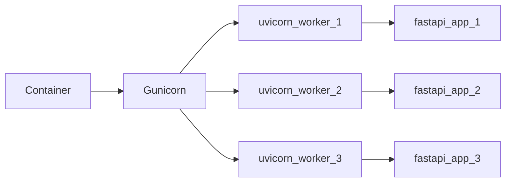
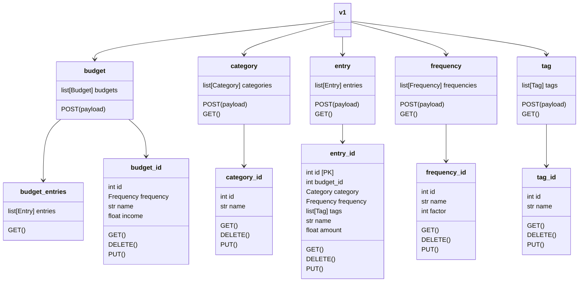
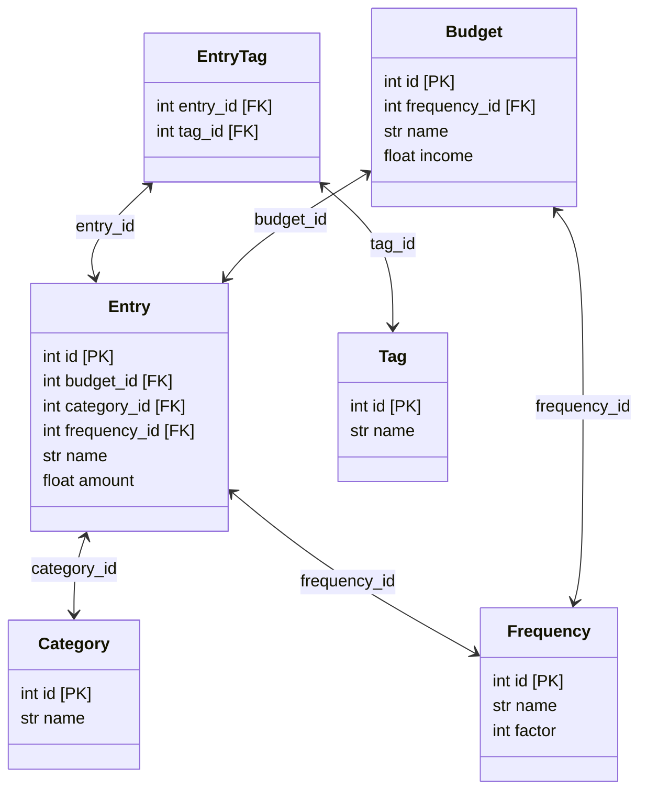

# Design Document

Presently, my budget is tracked through a Google Spreadsheet.

* Pro's
  * Easy to manipulate
  * Accessible
  * Easy to share
* Con's
  * Self-contained and hard to export
  * Building relational data is frustrating
  * Difficult to maintain as complexity increases

As part of a larger move to building an API-centric view into my finances, this
design document proposes a new backend API which supports performing basic
operations for building and managing a budget.

## Goals

* HTTP based API
* Supports CRUD operations for held data
* Data is persistent across operations
* Container-based
* Support for the following operations:
  * All operations for creating a budget and its associated entries
  * Categorizing budget entries
  * Tagging budget entries
  * Different entry frequencies (i.e. monthly or annually)
  * Totalizing entries to show the completeness of a budget

### Non-Goals

* Supports multiple users with authentication
* Supports tracking transactional data against the budget
* Provides a front-end for viewing data (this will be a separate project)

## Design

### Language

The application will be built using Python with a minimum supported version of
Python 3.9. It will encompass a single Python project which is managed by the
[Poetry][1] package manager. As noted in the goals, the application will be
distributed in a container and therefore it's not a requirement for the
application to be packaged (i.e. distributed in a wheel).

### API Backend

The API backend will be built with [FastAPI][2]. The organization and design
will follow the basic conventions laid out by the maintainer. It will contain
routes for all of the endpoints defined below and will serve as the primary
interface to the database backend documented below.

The FastAPI application will be served by [gunicorn][3] using the [uvicorn][4]
based [worker class][5]. Configuration of the workers will be done through the
supported [configuration file][6].

The following API endpoints will be made available:

### Container Backend

[Docker][7] will be the containerization technology. A Dockerfile will be
provided along with the source code and an image will be made available as part
of the CI pipeline. The image will be available via the
[Github Container Registry][8] and [DockerHub][9].

The container will be responsible for starting the `uvicorn` workers via
`guvicorn`. It will expose the following environment variables for
configuration:

| Name             | Default Value | Description                         |
|------------------|---------------|-------------------------------------|
| GUNICORN_WORKERS | 1             | Number of gunicorn workers to spawn |

### Data Backend

The API backend will use an RDBMS solution for persisting data between
transactions. Specifically, [CockroachDB][10] will be used as the RDBMS
provider. The database instance will be separate from the API container process
to allow flexibility with where the instance is hosted. A [Docker Compose][11]
file will be provided which includes a CockroachDB instance to make setup
easier.

The database will use the following table structure:

### Configuration

Configuration will be handled using the out-of-the-box support provided by
[Pydantic][12]. The following environment variables will be accepted to
configure the application (settings without a default value are required):

| Name             | Default Value | Description                         |
|------------------|---------------|-------------------------------------|
| COCKROACH_HOST   | localhost     | Hostname of the CockrachDB instance |
| COCKROACH_PORT   | 26257         | Port of the CockroachDB instance    |
| COCKROACH_USER   |               | The SQL user to connect with        |
| COCKROACH_PASS   |               | The password for the SQL user       |
| COCKROACH_DB     |               | The database to query               |
| COCKROACH_SSL    | 0             | Whether to enable SSL/TLS           |

## Alternatives Considered

### Alternative Language

The [Go][13] language was considered as a viable alternative, however, it was
not selected for the following reasons:

* Other microservices being used are already written with Python and FastAPI
* A rapid timeline is desired and Python is easier to iterate on
* More comfortability with the Python language

### Alternative API Backend

The following alternatives were considered:

* [Django REST][14]
  * More full-featured then what this application requires
  * Higher learning curve
* [Flask Restful][15]
  * ORM support is a bit lacking
  * Less community support and seems to be used less in production

### Alternative Data Backend

The first alternative considered was which type of backend to use: RDBMS or
NoSQL. The requirements of this project can theoretically fit both models, and
the reason to pick one over the other comes down to some finer details and a lot
of preference. NoSQL was ultimately dropped from consideration due to the
natural relational structure created by the supporting data. Additionally,
certain future operations might benefit from the more full-featured support of
a RDBMS SQL language.

As far as which RDBMS to use, again the various providers offer no real benefit
over each other due to the small nature of this project. Ultimately, this API
will be deployed into an existing microservice architecture which aims to be
serverless and for this reason alone CockroachDB was chosen due to it already
offering this feature out of the box.

[1]: https://python-poetry.org/
[2]: https://fastapi.tiangolo.com/
[3]: https://gunicorn.org/
[4]: https://www.uvicorn.org/
[5]: https://www.uvicorn.org/deployment/#gunicorn
[6]: https://docs.gunicorn.org/en/stable/configure.html#configuration-file
[7]: https://www.docker.com/
[8]: https://docs.github.com/en/packages/working-with-a-github-packages-registry/working-with-the-container-registry
[9]: https://hub.docker.com/
[10]: https://www.cockroachlabs.com/
[11]: https://docs.docker.com/compose/
[12]: https://pydantic-docs.helpmanual.io/usage/settings/
[13]: https://go.dev/
[14]: https://www.django-rest-framework.org/
[15]: https://github.com/flask-restful/flask-restful
